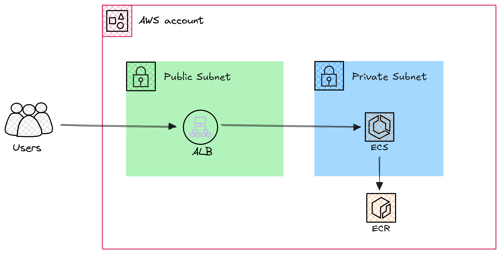
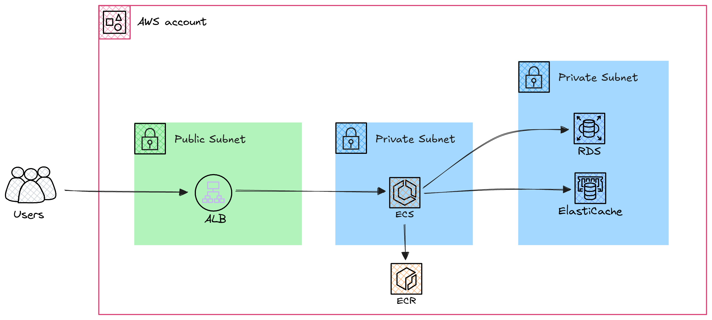

# Art Gallery Platform

## Project Concept

This project focuses on developing a scalable online platform for an art gallery. The application integrates a reliable backend and a dynamic frontend. The backend manages user authentication, artwork inventory, and order processing for prints or original art, while the frontend provides a seamless and engaging user experience for exploring and purchasing artworks. Additionally, caching mechanisms are employed to enhance performance, ensuring a robust and efficient user experience.

## Project Overview

This project is structured into three primary components: backend services (RDS and Redis), and the frontend. Each component plays a critical role in delivering a comprehensive solution. Below is a summary of the key elements:

- **Backend (RDS)**: Built with a focus on scalability and reliability, managing relational database operations for artworks, artists, and user data.
- **Backend (Redis)**: Optimized for session caching and quick access to frequently viewed artwork or user data.
- **Frontend**: Designed to provide a dynamic and interactive user interface for users to browse art collections and make purchases.

The platform utilizes PostgreSQL for database management and Redis for caching, ensuring optimal performance.


## File Structure

### 1. **Backend (RDS)**
- **Purpose**: Manages application logic and integrates with a relational database service.
- **Files**:
  - `manage.py`: Entry point for the backend application.
  - `requirements.txt`: Lists dependencies for the project.
  - `backend_rds/`: Contains the core backend logic, configuration files, and routes for the application.

### 2. **Backend (Redis)**
- **Purpose**: Handles backend logic with Redis for caching.
- **Files**:
  - `manage.py`: Entry point for the backend application.
  - `requirements.txt`: Lists dependencies for the project.
  - `backend_redis/`: Contains the core backend logic, configuration files, and routes for the application.

### 3. **Frontend**
- **Purpose**: Provides the user interface.
- **Files**:
  - `manage.py`: Entry point for the frontend application.
  - `requirements.txt`: Lists frontend dependencies.
  - `frontend/`: Contains configuration files, routing, views, and templates for the frontend interface.

## Local Testing

### Step 1: Cloning the Repository
Clone the repository to your local machine and navigate to the project directory:
```bash
git clone https://github.com/THE-GAME-DEVOPS/art-gallery.git
cd art-gallery
```

### Step 2: Writing Dockerfiles for Services
Write a `Dockerfile` for each service, including:
- Backend RDS
- Backend Redis
- Frontend

Ensure each `Dockerfile` is properly configured to build and run its respective service.

### Step 3: Creating `docker-compose.yml` and Environment Variables
Write a `docker-compose.yml` file to define all the services, including Redis, PostgreSQL, and backend services. Include the following:
- **Redis**: Use the official Redis image ([Redis Docker Hub](https://hub.docker.com/_/redis)).
- **PostgreSQL**: Use the official PostgreSQL image ([PostgreSQL Docker Hub](https://hub.docker.com/_/postgres)).
- **backend-rds**: This service should depend on PostgreSQL.
- **backend-redis**: This service should depend on Redis.
- **Frontend**: Use the frontend Dockerfile built.

***Make sure to place the corresponding `Dockerfile` for each backend service in the correct directory.***

### Step 4: Building and Running Services
Build and start all services using Docker Compose with the `--build` option to rebuild images:
```bash
docker-compose up -d --build
```

### Step 5: Monitoring Logs
To troubleshoot issues and monitor logs for each service:
- View logs for all services:
  ```bash
  docker-compose logs -f
  ```
- View logs for a specific service (e.g., backend-rds):
  ```bash
  docker-compose logs -f backend-rds
  ```
- Stop monitoring logs by pressing `Ctrl+C`.

### Step 6: Testing the Frontend
After starting all services, verify that the frontend served by Nginx is accessible.

### Step 7: Stopping Services
To stop all running services:
```bash
docker-compose down
```

## AWS Deployment

### Step 0: Provisioning Network and Storage

Before deploying any services, provision the foundational networking and storage infrastructure:

- Use **Terraform** to create a **VPC**, with public and private subnets, route tables, and gateways.
- Create **two public** and **two private subnets** across different availability zones.
- Set up **one NAT Gateway** to allow private subnets secure outbound internet access.


### Step 1: Creating Amazon ECR and Pushing Images

- Manually create **Amazon ECR repositories** for each service (e.g., frontend, backend-rds, backend-redis). This avoids accidental deletion when using `terraform destroy`.
- Write CI/CD pipelines (e.g., GitHub Actions, GitLab CI) to build Docker images and push them to ECR. 
Pipeline steps:
  - Log in to ECR using AWS CLI
  - Build Docker image
  - Tag image with ECR URI
  - Push image to ECR

### Step 2: Deploying ALB and ECS



- Use **Terraform** to create an **Application Load Balancer (ALB)** in the **public subnet**.
- Launch an **ECS cluster** in the **private subnet** to run your services.
- Define task definitions and ECS services for the frontend and backend.
- Configure **security groups** for the ALB and ECS services to control inbound and outbound traffic.
- Use **AWS Cloud Map** for service discovery, allowing the frontend to communicate with backend services using internal DNS names.


### Step 3: Provisioning Databases



- Use **Terraform** to provision **RDS (PostgreSQL)** and **ElastiCache (Redis)** in **private subnets**.
- Set up **subnet groups**, **parameter groups**, and **security groups** for both services.
- Configure backend services to connect using endpoint environment variables.
- Ensure secure internal communication between ECS tasks and database services.

### Final Step: Testing the Application

Once the infrastructure and services are deployed, test the application as follows:

1. **Access the Frontend**:
   - Open the DNS name of the Application Load Balancer in your browser.
   - Ensure the frontend loads correctly.

2. **Verify Frontend to Backend Communication**:
   - Trigger actions from the frontend (press buttons to test connection).
   - Confirm requests return valid responses.

## Final Thoughts

Congratulations on successfully setting up and integrating your art gallery application with Amazon ECS!
<p align="center">
  
</p>

 This achievement highlights your understanding of scalable and efficient containerized application deployment, as well as your ability to manage real-world systems on AWS. Keep experimenting, refining, and advancing your skills as you continue your DevOps journey.